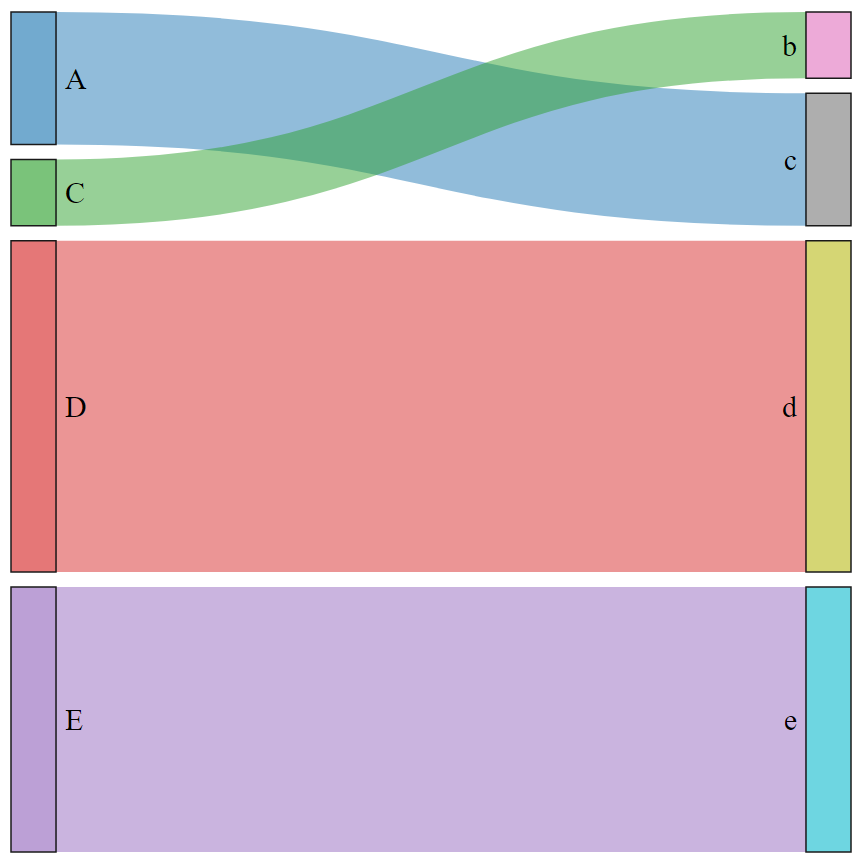
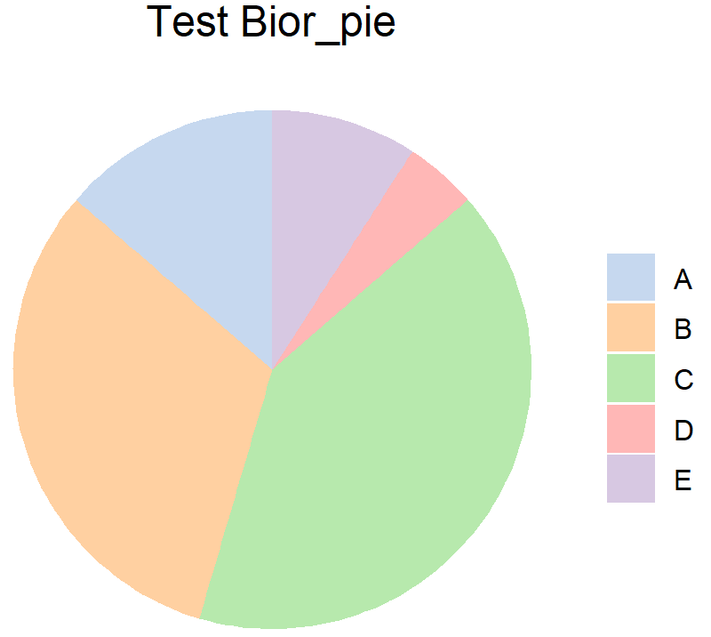

# Basic Plot 

Some basic plots commonly used

## Bior_Sankey

**Description**\
A sankey plot, you can use Nodes.colour and Nodes.order to set Nodes colour and
order, this function will automatically remove links$value==0 rows\
**Usage**\
Bior_Sankey(links, Nodes.colour=NULL, Nodes.order=NULL, fontSize=12,nodeWidth=30, 
nodePadding=10, margin=NULL, height=600, width=600, sinksRight=TRUE)\
**Arguments**\
* links: A dataframe, colnames must have 'source' 'target' 'value'\
* Nodes.colour: Set nodes colour\
* Nodes.order: Set nodes order\
* fontSize: Set fontsize\
* nodeWidth: Set nodewidth\
* nodePadding: Set the gap size between nodes\
* margin: R margin\
* height: numeric height for the network graph's frame area in pixels\
* width: numeric width for the network graph's frame area in pixels\
* sinksRight: boolean. If TRUE, the last nodes are moved to the right border of the plot\
**Examples**\
```{r,eval = FALSE}
# links data, colnames must have 'source' 'target' 'value'
links <- data.frame(
  source=c("C","A", "B", "E", "D"), 
  target=c("b","c", "a", "e", "d"), 
  value=c(1, 2, 0, 4, 5)
)
# Set Nodes order and colour
Nodes.order <- c("A", "B", "C", "D", "E", "a", "b", "c", "d", "e")
Nodes.colour <- pal_d3("category20", alpha = 0.7)(20)
p <- Bior_Sankey(links, Nodes.order=Nodes.order, Nodes.colour=Nodes.colour, fontSize=20)
p
# Use saveNetwork() to save the plot as html
saveNetwork(p,"sankey.html")
```



## Bior_pie

**Description**\
Pie plot\
**Usage**\
Bior_pie(x, labels, col=pal_d3("category20",alpha=0.7)(20), title="", fontsize=20, legend.key.size=1)\
**Arguments**\
* x: A vector of value\
* labels: A vector of labels for x\
* col: colour\
* title: title\
* fontsize: fontsize\
* legend.key.size: legend size\
**Examples**\
```{r,eval = FALSE}
x <- c(3,7,9,1,2)
labels <- c("A", "B", "C", "D", "E")
col <- c("#AEC7E8B2", "#FFBB78B2", "#98DF8AB2", "#FF9896B2", "#C5B0D5B2")
p <- Bior_pie(x, labels, col=col, title="Test Bior_pie")
p
```



