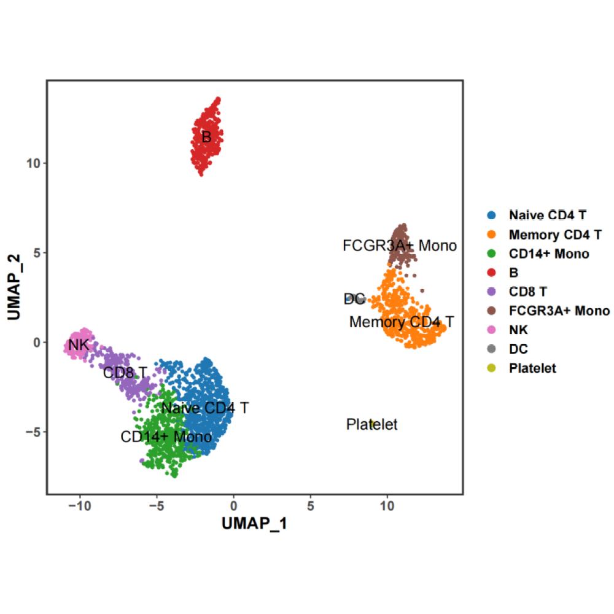
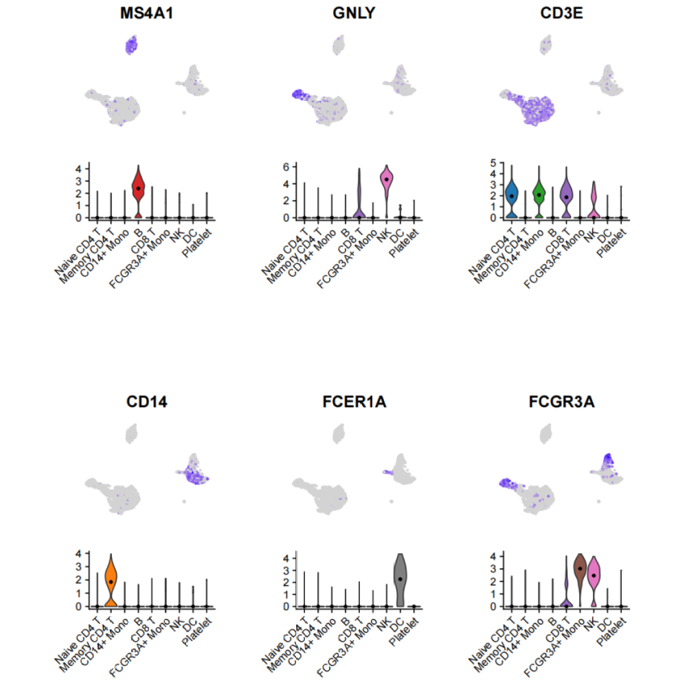

# scRNAseq Plot

Some plots commonly used in scRNAseq analysis.\
The test data used in Examples is [Seurat Tutorial Data](https://satijalab.org/seurat/archive/v3.1/pbmc3k_tutorial.html)\
```{r,eval = FALSE}
# load test data
seuratobject <- readRDS("testdata/pbmc3k_final.rds")
# colors
cols <- pal_d3("category20")(20)
```

## Bior_DimPlot

**Description**\
Plot based on Seurat::DimPlot()\
**Usage**\
Bior_DimPlot(seuratobject, reduction="umap", pt.size=1, label = TRUE, label.size=5, cols=NULL)\
**Arguments**\
* seuratobject: Seurat object\
* reduction: Choose "umap" or "tsne"\
* pt.size: Adjust cell point size\
* label: Whether to label the clusters\
* label.size: Sets size of labels\
* cols: colors\
**Examples**
```{r,eval = FALSE}
p <- Bior_DimPlot(seuratobject, cols = cols)
p
```


## Bior_FeatureVlnplot

**Description**\
Simultaneously plot multiple genes Featureplot and Vlnplot\
**Usage**\
Bior_FeatureVlnplot(seuratobject, genes, title.size=15, axis.text.size=10, pt.size=1, nrow=1, scale=1, cols=NULL)\
**Arguments**\
* seuratobject: Seurat object\
* genes: Multiple genes vectors, eg: c("MS4A1", "GNLY", "CD3E")\
* title.size: title gene name size\
* axis.text.size: x-axis text size\
* pt.size: Featureplot point size\
* nrow: Number of rows in the plot grid\
* scale: scale the size of all or select plots\
* cols: Vlnplot cluster colors\
**Examples**\
```{r,eval = FALSE}
genes <- c("MS4A1", "GNLY", "CD3E", "CD14", "FCER1A", "FCGR3A")
p <- Bior_FeatureVlnplot(seuratobject, genes, scale=0.8, pt.size=0.5, nrow=2, cols=cols)
p
```



