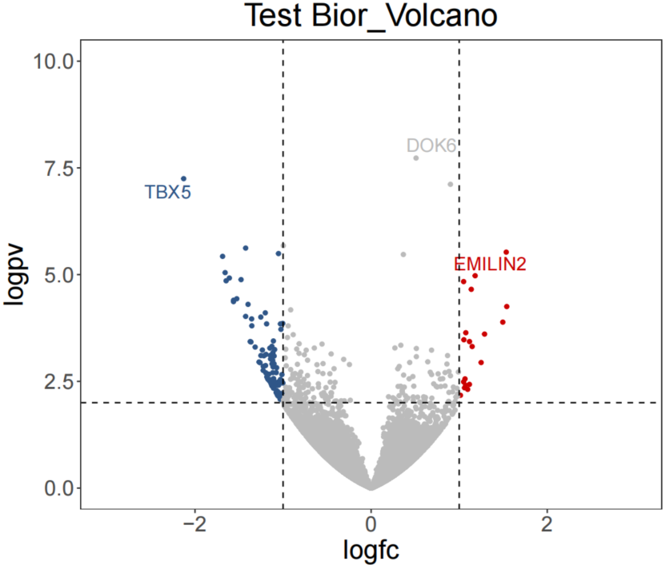

# NGS Plot 

Some plots commonly used in NGS analysis.\

## Bior_Volcano

**Description**\
Volcano plot\
**Usage**\
Bior_Volcano(logfc, pvalue, logfc.threshold.up=1, logfc.threshold.Down=-1, 
pvalue.threshold=0.01, point.size=2, point.shape= 20, fontsize=20, title='', 
limits.x=c(-10,10), limits.y=c(0,15), legend.position="right")\
**Arguments**\
* logfc: RNAseq log2FoldChange\
* pvalue: RNAseq pvalue\
* logfc.threshold.up: log2FoldChange threshold for up genes\
* logfc.threshold.Down: log2FoldChange threshold for down genes\
* pvalue.threshold: pvalue threshold for differential genes\
* point.size: point size\
* fontsize: fontsize\
* title: title\
* limits.x: x-axis range\
* limits.y: y-axis range\
* legend.position: legend position, you can choose one in {'left','top','right',
'bottom','none'}\
**Examples**\
```{r,eval = FALSE}
data <- read.table('testdata/Bior_Volcano.txt', header=T)
logfc <- data$log2FoldChange
pvalue <- data$pvalue
p <- Bior_Volcano(logfc, pvalue, title="Test Bior_Volcano", legend.position="none",
                  limits.x=c(-3,3),limits.y=c(0,10))
p
```



